The best way to convince your prospects of the value of your product is to let them try it. Let's say for a short period of time, 14 days.

Here is how I came to implement this in [Lembot ↗](https://lembot.com).

With [Stripe ↗](https://stripe.com) as payment platform.

## Back-end

At sign up:

1. create your User
2. create a Stripe [<code>Customer</code> ↗](https://stripe.com/docs/api/customers/create)
3. add the Stripe Customer's [<code>id</code> ↗](https://stripe.com/docs/api/customers/object#customer_object-id) to your User
4. compute the trial end date (eg. `now + 14 days`) and add it to your User too.

So your User database should look like:

| id  | email       | password | stripeCustomerId   | trialEndAt          |
| --- | ----------- | -------- | ------------------ | ------------------- |
| 1   | me@mail.com | hidden   | cus_JCnZPUfKfFarTf | 2021-07-04T00:00:00 |

## Front-end

First, check the [Stripe Subscription API ↗️](https://stripe.com/docs/api/subscriptions/list) to list the user's current subscriptions.

If the API returns a subscription, then grant the user access to your website. Also, provide a link to the [Customer Portal ↗️](https://stripe.com/docs/api/customer_portal) page so the user is free to cancel its subscription anytime.

Otherwise check `trialEndAt`:

If `trialEndAt` date is in the future, then grant User access to your website. Else, tell your user the trial period is over and ask to subscribe. In both case, provide a link to the [Stripe Checkout ↗️](https://stripe.com/docs/billing/subscriptions/checkout) payment page so User can subscribe.

Here is the state diagram:

```mermaid
%%{init: {'theme':'dark'}}%%
stateDiagram-v2
    S1 : Stripe Subscription API
    A : ✅ Access Granted
    AT : ✅ Access Granted (Trial)
    SBP : Stripe Customer Portal
    CT : Check <code>trialEndAt</code>
    SCL : Stripe Checkout
    D : ❌ End Of Trial

    [*] --> S1
    state if_state <<choice>>
    S1 --> if_state
    if_state --> A : subcription
    if_state --> CT : no subscription

    A --> SBP

    state if_state_trial <<choice>>
    CT --> if_state_trial
    if_state_trial --> AT : now <= trialEndAt
    if_state_trial --> D : trialEndAt < now

    AT --> SCL
    D --> SCL
```

## A quick word about the Stripe Subscription API

Stripe API allows to create a subscription without specifying any payment method and using the parameter [<code>trial_period_days</code> ↗️](https://stripe.com/docs/api/subscriptions/create#create_subscription-trial_period_days).

So it's tempting to create a subscription with a trial at sign up. That's what I did at first 😅...

But that's not what you want. Why?

Here is the documentation for `trial_period_days`:

> Integer representing the number of trial period days before the customer is charged for the first time.

Indeed, at the end of the trial, Stripe automatically charges the customer and create an invoice for the upcoming month.

Even if the customer has no payment method.

Obviously, since no payment method has been entered, Stripe is not able to charge the customer. As a result, at the end of the month Stripe automatically cancels the subscription and keep the unpaid invoice.

That's not what you want because you don't want your customer to have an unpaid invoice in its Customer Portal. Your customer was there to try for 14 days, no reason to be charged.

Below, a screenshot of the Stripe Customer Portal in this situation. The current plan is empty because Stripe ended up canceling the Subscription and the first invoice remains unpaid.

_Stripe Customer Portal_

_Disclamer: I am not saying that it's a bug. I now realize it is well designed. It is designed this way so both [Stripe Checkout ↗](https://stripe.com/docs/payments/checkout) and [Customer Portal ↗](https://stripe.com/docs/billing/subscriptions/customer-portal) pages are consistent with each other and work out-of-the-box._

## Thank you

Hope it helps.
